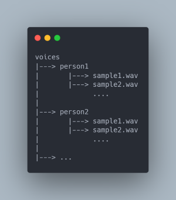
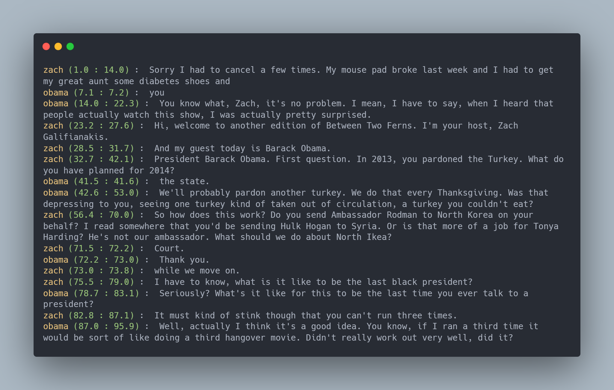

<p align="center">
  
</p>

<p align="center">
    <a href="./LICENSE"></a>
    <a href="https://github.com/Navodplayer1/speechlib/releases"></a>
    <a href="support os"></a>
    <a href=""></a>
    <a href="https://github.com/Navodplayer1/speechlib/graphs/contributors"></a>
    <a href="https://github.com/Navodplayer1/speechlib/issues"></a>
    <a href="https://github.com/Navodplayer1/speechlib/stargazers"></a>
    <a href="https://pypi.org/project/speechlib/"></a>
    
</p>

### Run your IDE as administrator

you will get following error if administrator permission is not there:

**OSError: [WinError 1314] A required privilege is not held by the client**

### Requirements

* Python 3.8 or greater

### GPU execution

GPU execution needs CUDA 11.  

GPU execution requires the following NVIDIA libraries to be installed:

* [cuBLAS for CUDA 11](https://developer.nvidia.com/cublas)
* [cuDNN 8 for CUDA 11](https://developer.nvidia.com/cudnn)

There are multiple ways to install these libraries. The recommended way is described in the official NVIDIA documentation, but we also suggest other installation methods below.

### Google Colab:

on google colab run this to install CUDA dependencies:
```
!apt install libcublas11
```

You can see this example [notebook](https://colab.research.google.com/drive/1lpoWrHl5443LSnTG3vJQfTcg9oFiCQSz?usp=sharing)

### installation:
```
pip install speechlib
```

This library does speaker diarization, speaker recognition, and transcription on a single wav file to provide a transcript with actual speaker names. This library will also return an array containing result information. ⚙ 

This library contains following audio preprocessing functions:

1. convert other audio formats to wav

2. convert stereo wav file to mono

3. re-encode the wav file to have 16-bit PCM encoding

Transcriptor method takes 6 arguments. 

1. file to transcribe

2. log_folder to store transcription

3. language used for transcribing (language code is used)

4. model size ("tiny", "small", "medium", "large", "large-v1", "large-v2", "large-v3")

5. voices_folder (contains speaker voice samples for speaker recognition)

6. quantization: this determine whether to use int8 quantization or not. Quantization may speed up the process but lower the accuracy.

voices_folder should contain subfolders named with speaker names. Each subfolder belongs to a speaker and it can contain many voice samples. This will be used for speaker recognition to identify the speaker.

if voices_folder is not provided then speaker tags will be arbitrary.

log_folder is to store the final transcript as a text file.

transcript will also indicate the timeframe in seconds where each speaker speaks.

### Transcription example:

```
from speechlib import Transcriptor

file = "obama_zach.wav"
voices_folder = "voices"
language = "en"
log_folder = "logs"
modelSize = "medium"
quantization = False   # setting this 'True' may speed up the process but lower the accuracy

transcriptor = Transcriptor(file, log_folder, language, modelSize, voices_folder, quantization)

res = transcriptor.transcribe()

res --> [["start", "end", "text", "speaker"], ["start", "end", "text", "speaker"]...]
```

#### if you don't want speaker names: keep voices_folder as an empty string ""

start: starting time of speech in seconds  
end: ending time of speech in seconds  
text: transcribed text for speech during start and end  
speaker: speaker of the text 

#### voices_folder structure:  



#### Transcription:  



supported language codes:  

```
"af", "am", "ar", "as", "az", "ba", "be", "bg", "bn", "bo", "br", "bs", "ca", "cs", "cy", "da", "de", "el", "en", "es", "et", "eu", "fa", "fi", "fo", "fr", "gl", "gu", "ha", "haw", "he", "hi", "hr", "ht", "hu", "hy", "id", "is","it", "ja", "jw", "ka", "kk", "km", "kn", "ko", "la", "lb", "ln", "lo", "lt", "lv", "mg", "mi", "mk", "ml", "mn","mr", "ms", "mt", "my", "ne", "nl", "nn", "no", "oc", "pa", "pl", "ps", "pt", "ro", "ru", "sa", "sd", "si", "sk","sl", "sn", "so", "sq", "sr", "su", "sv", "sw", "ta", "te", "tg", "th", "tk", "tl", "tr", "tt", "uk", "ur", "uz","vi", "yi", "yo", "zh", "yue"
```

supported language names:

```
"Afrikaans", "Amharic", "Arabic", "Assamese", "Azerbaijani", "Bashkir", "Belarusian", "Bulgarian", "Bengali","Tibetan", "Breton", "Bosnian", "Catalan", "Czech", "Welsh", "Danish", "German", "Greek", "English", "Spanish","Estonian", "Basque", "Persian", "Finnish", "Faroese", "French", "Galician", "Gujarati", "Hausa", "Hawaiian","Hebrew", "Hindi", "Croatian", "Haitian", "Hungarian", "Armenian", "Indonesian", "Icelandic", "Italian", "Japanese","Javanese", "Georgian", "Kazakh", "Khmer", "Kannada", "Korean", "Latin", "Luxembourgish", "Lingala", "Lao","Lithuanian", "Latvian", "Malagasy", "Maori", "Macedonian", "Malayalam", "Mongolian", "Marathi", "Malay", "Maltese","Burmese", "Nepali", "Dutch", "Norwegian Nynorsk", "Norwegian", "Occitan", "Punjabi", "Polish", "Pashto","Portuguese", "Romanian", "Russian", "Sanskrit", "Sindhi", "Sinhalese", "Slovak", "Slovenian", "Shona", "Somali","Albanian", "Serbian", "Sundanese", "Swedish", "Swahili", "Tamil", "Telugu", "Tajik", "Thai", "Turkmen", "Tagalog","Turkish", "Tatar", "Ukrainian", "Urdu", "Uzbek", "Vietnamese", "Yiddish", "Yoruba", "Chinese", "Cantonese",
```

### Audio preprocessing example:

```
from speechlib import PreProcessor

file = "obama1.mp3"

# convert mp3 to wav
wav_file = PreProcessor.convert_to_wav(file)   

# convert wav file from stereo to mono
PreProcessor.convert_to_mono(wav_file)

# re-encode wav file to have 16-bit PCM encoding
PreProcessor.re_encode(wav_file)
```

### Performance
```
These metrics are from Google Colab tests.
These metrics do not take into account model download times.
These metrics are done without quantization enabled.
(quantization will make this even faster)

metrics for faster-whisper "tiny" model:
    on gpu:
        audio name: obama_zach.wav
        duration: 6 min 36 s
        diarization time: 24s
        speaker recognition time: 10s
        transcription time: 64s


metrics for faster-whisper "small" model:
    on gpu:
        audio name: obama_zach.wav
        duration: 6 min 36 s
        diarization time: 24s
        speaker recognition time: 10s
        transcription time: 95s


metrics for faster-whisper "medium" model:
    on gpu:
        audio name: obama_zach.wav
        duration: 6 min 36 s
        diarization time: 24s
        speaker recognition time: 10s
        transcription time: 193s


metrics for faster-whisper "large" model:
    on gpu:
        audio name: obama_zach.wav
        duration: 6 min 36 s
        diarization time: 24s
        speaker recognition time: 10s
        transcription time: 343s
```

#### why not using pyannote/speaker-diarization-3.1, speechbrain >= 1.0.0, faster-whisper >= 1.0.0:

because older versions give more accurate transcriptions. this was tested.

with pyannote/speaker-diarization-3.1, speechbrain >= 1.0.0, faster-whisper >= 1.0.0:

```
zach (5.2 : 7.7) :  Sorry, I had a canceled a few times, but... 
zach (9.0 : 12.0) :  My mouse pad broke as we had to get my great answer. 
obama (12.0 : 22.2) :  diabetes shoes and it's no problem.  I mean, I have to say when I heard that people actually watch this show as I was actually  pretty surprised. 
zach (23.2 : 27.7) :  Hi, welcome to another edition of Between Two Furns.  I'm your host, Zach Gallethonakis. 
zach (28.0 : 28.1) :  You 
zach (28.5 : 31.8) :  And my guest today is Barack Obama. 
zach (32.7 : 36.5) :  President Barack Obama, good to be with you, Zack.  First question. 
zach (36.9 : 39.2) :  in 2013, part in the Turkey. 
zach (39.4 : 41.7) :  What do you have planned for 2014? 
obama (42.7 : 49.9) :  We'll probably pardon another turkey.  We do that every Thanksgiving.  Was that depressing to you seeing a one turkey? 
obama (50.3 : 53.0) :  going to take an out of circulation, turkey you couldn't eat. 
zach (56.4 : 65.8) :  So how does this work? Do you send a Ambassador Rodman to North Korea on your behalf?  I'd read somewhere that you'd be sitting in Hulk Hogan, a Syria, or is that more of a job for Tony Harding? 
obama (66.4 : 68.0) :  Exactly, he's not our ambassador. 
zach (68.5 : 68.5) : 
obama (68.5 : 69.2) :  What should we do with that? 
zach (69.2 : 69.2) : 
obama (69.2 : 69.3) :  Thank you very much for watching this video and I'll see you in the next video. 
zach (69.3 : 69.3) : 
obama (69.3 : 69.3) : 
zach (69.3 : 69.9) :  and we'll take care. 
obama (71.5 : 72.0) :  too. 
zach (72.0 : 72.0) : 
obama (72.0 : 72.1) :  . 
zach (72.1 : 72.2) : 
obama (72.2 : 72.2) : 
zach (73.0 : 73.7) :  while we move on. 
zach (75.5 : 78.2) :  I have to know, what is it like to be the last black president? 
obama (78.7 : 79.4) :  Seriously? 
obama (79.9 : 83.0) :  What's it like for this to be the last time you ever talk to a prey? 
zach (82.8 : 87.2) :  It must kind of stink though that you can't run three times. 
obama (86.8 : 89.2) :  You know, actually I think it's a good idea. 
obama (89.4 : 89.9) :  . 
obama (90.3 : 94.0) :  If I ran a third time, it'd be sort of like doing a third hangover movie. 
obama (94.4 : 95.8) :  didn't really work out very well did. 
obama (97.4 : 99.8) :  Now I have to say that I've seen this show before and... 
obama (100.4 : 100.8) :  of… 
obama (101.1 : 109.4) :  Some of the episodes are probably a little bit better than this, you know, for example, the one with Bradley Cooper, that was a great brand.  She kind of carried that movie, didn't it? 
zach (108.3 : 108.6) :  . 
zach (112.1 : 113.6) :  Which, which film are you thinking of? 
obama (114.1 : 118.7) :  Those hangover movies, basically he carried them. 
zach (118.7 : 120.0) :  Yeah, everybody loves Bradley. 
zach (120.3 : 121.0) :  Good for him. 
obama (121.3 : 122.1) :  Good luck in guy. 
zach (122.1 : 124.0) :  being like that and how that's easy. 
zach (124.3 : 128.1) :  Paul handsomeets he'd be short fat and smell like Doritos and try to make it Hollywood. 
zach (130.6 : 136.0) :  Is it going to be hard in two years when you're no longer president and people will stop letting  you win a basketball? 
zach (136.3 : 138.5) :  How does it feel having a 3 inch vertical? 
zach (138.7 : 140.0) :  It's a three inch horizontal. 
zach (140.8 : 141.2) :  So. 
zach (144.0 : 148.5) :  Where are you planning on building a presidential library in Hawaii or your home country of Kenya?  Because... 
zach (149.7 : 152.0) :  I mean both places seem like they would be... 
obama (152.0 : 153.4) :  Exactly, that's a ridiculous question. 
zach (153.4 : 153.5) :  You 
obama (153.5 : 153.5) : 
zach (153.5 : 156.0) :  Well, you know, I mean, not to bring up the birth certificate thing that you... 
obama (156.0 : 160.1) :  I really never did really produce you.  Where's your verse?  Why don't you show it to us right now?  I don't know. 
zach (157.5 : 158.0) :  Where's your- 
zach (160.0 : 162.4) :  I don't want to show anybody my birth certificate because it's embarrassing. 
obama (162.4 : 163.3) :  What's embarrassing about it? 
zach (163.3 : 163.3) : 
zach (163.4 : 166.7) :  My weight on it, it says that I was born seven pounds. 
zach (167.1 : 168.1) :  800 ounces. 
zach (170.0 : 171.9) :  You know what I'll do if I were president, Mr. President. 
zach (172.4 : 175.0) :  I would make same-sex divorce illegal. 
zach (175.4 : 176.7) :  then see how bad they want it. 
zach (177.7 : 178.4) :  I think that's... 
obama (179.1 : 179.1) : 
zach (179.1 : 179.3) :  What? 
obama (179.3 : 179.5) :  You 
zach (179.5 : 180.0) :  President. 
obama (180.0 : 180.1) :  You 
zach (180.1 : 180.1) : 
obama (180.1 : 180.1) : 
obama (180.6 : 180.7) : 
zach (180.7 : 181.0) :  I'm not too 
obama (181.0 : 181.4) :  good thing. 
zach (182.0 : 188.5) :  You said if you had a son, you would not let him play football.  What makes you think that he would want to play football?  What if he was a nerd like you? 
obama (189.1 : 191.1) :  Do you think a woman like Michelle would marry a nerd? 
obama (192.5 : 195.3) :  I want you to ask her whether she thinks I'm a nerd. 
obama (195.6 : 196.1) :  Good night. 
obama (196.4 : 197.9) :  No, I'm not going to let her near you. 
zach (199.6 : 205.8) :  So do you go to any websites that are dot coms or dot nets  or do you mainly just stick with dot gobs? 
obama (206.7 : 210.5) :  No, actually we go to dot-govs, have you heard of health care dot-gov? 
zach (213.0 : 215.3) :  Okay, let's get this out of the way.  What did you come here to plug? 
obama (216.0 : 221.5) :  Well, first of all, I think it's fair to say that I wouldn't be with you here today if I didn't have something to plug. 
obama (221.7 : 223.4) :  Have you heard of the Affordable Care Act? 
zach (223.6 : 228.1) :  Oh, yeah, I heard about that. That's the thing that doesn't work. Why would you get the guy that created the zone? 
zach (228.4 : 230.2) :  to make your website. 
obama (229.9 : 232.1) :  healthcare.gov works great now. 
obama (232.6 : 234.7) :  and millions of Americans have already gotten. 
obama (235.3 : 238.9) :  health insurance plans and what we want is for people to know. 
obama (239.4 : 250.6) :  that you can get a formal health care.  And most young Americans right now, they're not covered.  And the truth is that they can get coverage  all for what it cost you. 
obama (251.0 : 253.0) :  to pay yourself on them. 
obama (253.1 : 257.5) :  This is what they mean by drones.  The point is that a lot of young people. 
obama (257.6 : 258.9) :  They think they're invincible. 
obama (259.3 : 263.5) :  Did you say it invisible?  Because no, it's not like that's... 
zach (262.5 : 263.1) :  No, no. 
zach (263.5 : 263.5) : 
obama (263.5 : 263.6) : 
zach (263.6 : 263.7) :  up. 
obama (263.7 : 266.0) :  not invisible, invincible. 
obama (266.6 : 269.2) :  meaning that they don't think they can get hurt. 
zach (269.2 : 272.1) :  I'm just saying that nobody could be invisible if you had said invisible. 
obama (272.1 : 272.9) :  I understand that. 
obama (274.2 : 279.0) :  If they get that health insurance, it can really make a big difference, and they've got  until March 31st to sign up. 
zach (279.0 : 279.5) :  I don't have a computer. 
obama (279.5 : 279.6) : 
zach (279.6 : 280.5) :  So who had us? 
obama (280.5 : 282.2) :  Well then you can call 1-800. 
obama (282.6 : 283.5) :  318. 
obama (283.6 : 285.0) :  2596. 
zach (285.0 : 289.8) :  I don't have a phone, I'm off the grid, I don't want you people looking at my text if you know what I mean. 
obama (290.8 : 300.9) :  First of all, is that nobody's interested in your taxes.  But second of all, you can do it in person.  And the law means that insurers can't discriminate against you.  If you've got to pre-existing condition anymore. 
zach (300.9 : 301.6) :  Yeah, but what about? 
obama (303.1 : 303.1) : 
zach (303.1 : 304.0) :  What about this though? 
obama (304.0 : 304.0) : 
zach (304.0 : 304.1) : 
obama (308.8 : 312.8) :  That's the discussion, how long have you had it?  I'll just four months. 
zach (314.1 : 314.4) :  Really? 
obama (314.1 : 314.3) :  So 
obama (314.4 : 314.4) : 
zach (314.4 : 315.6) :  Spider-Bytes. 
obama (316.3 : 317.5) :  I got attacked by spiders. 
obama (318.1 : 322.4) :  Zack you you need to get that checked right away you need to get on health care.gov because 
obama (323.6 : 325.6) :  That's one of the most disgusting things I've ever seen. 
zach (325.8 : 327.0) :  is your plug finally over? 
zach (327.4 : 328.1) :  of 
zach (330.0 : 333.0) :  I suppose so.  So which country were you rooting for and the winner Olympic? 
obama (333.0 : 334.7) :  x. Seriously? 
zach (334.7 : 334.8) :  You 
obama (336.9 : 339.0) :  I'm the president of the United States, what do you think, Zach? 
zach (342.4 : 347.4) :  I want to thank President Obama for being on the show.  I'm going to press this.  I don't touch that, please. 
zach (354.6 : 359.6) :  Thanks for the interview and thanks for letting me shoot my show here all these years. 
obama (360.4 : 362.8) :  You've been shooting these, these showers. 
obama (363.4 : 364.5) :  here in the diplomatic room. 
obama (365.8 : 367.1) :  Who gave you permission to do that? 
obama (368.2 : 368.5) :  Thank you very much. 
obama (369.2 : 369.9) :  Seriously? 
obama (370.2 : 371.3) :  Who gave him clearance? 
unknown (377.7 : 378.5) :  What's the spider bite? 
obama (379.7 : 380.4) :  That's the other hand. 
unknown (380.7 : 381.8) :  It's not all, it's everywhere. 

```

with pyannote/speaker-diarization@2.1, speechbrain==0.5.16, faster-whisper==0.10.1:

```
zach (1.0 : 14.0) :  Sorry, I had to cancel a few times, but my mouse pad broke, and I had to get my great 
obama (7.1 : 7.2) :  You 
obama (14.0 : 22.3) :  It's no problem.  I mean, I have to say when I heard that people actually watch this show as I was actually pretty surprised. 
zach (23.2 : 27.6) :  Hi, welcome to another edition of Between Two Furns.  I'm your host, Zach Gallethonakis. 
zach (28.5 : 31.7) :  And my guest today is Barack Obama. 
zach (32.7 : 42.1) :  President Barack Obama, good to be with you, Zack.  First question.  In 2013, he pardoned the Turkey.  What do you have planned for 2014? 
obama (41.5 : 41.6) :  Thank you. 
obama (42.6 : 53.0) :  we'll probably pardon another turkey. We do that every Thanksgiving. Was that depressing  to you seeing a one turkey taken out of circulation turkey you couldn't eat? 
zach (56.4 : 70.0) :  So how does this work? Do you send a ambassador  Rodman to North Korea on your behalf?  I'd read somewhere that you'd be sitting  Hulk Hogan to Syria, or is that more of a job  or Tonya Harding?  Exactly, he's not our ambassador.  What should we do about North IKEA? 
zach (71.5 : 72.2) :  Good. 
obama (72.2 : 73.0) :  Thank you. 
zach (73.0 : 73.8) :  We will move on. 
zach (75.5 : 79.0) :  I have to know, what is it like to be the last black president? 
obama (78.7 : 83.1) :  Seriously, what's it like for this to be the last time you ever talk to a president? 
zach (82.8 : 87.1) :  It must kind of stink though that you can't run three times. 
obama (87.0 : 95.9) :  Actually, I think it's a good idea, if I ran a third time  it'd be sort of like doing a third hangover movie,  it didn't really work out very well. 
obama (97.4 : 99.8) :  Now I have to say that I've seen this show before and 
obama (100.4 : 109.5) :  Some of the episodes are probably a little bit better than this, you know, for example, the one with Bradley Cooper, that was a great brand.  She kind of carried that movie, didn't he? 
zach (108.2 : 108.7) :  as you kind of care. 
zach (112.1 : 113.7) :  which film are you seeing us? 
obama (114.1 : 119.0) :  Those hangover movies, basically he carried them. 
zach (118.6 : 121.4) :  Yeah, everybody loves Bradley. Good for him. 
obama (121.4 : 122.1) :  Good luck, guys. 
zach (122.1 : 128.1) :  being like that in Hollywood. That's easy. Paul Hansome, that'd be short fat and smell like Doritos and try to make it Hollywood. 
zach (130.6 : 141.5) :  Is it going to be hard in two years when you're no longer president and people will stop  letting you win a basketball?  How does a field have in a three inch vertical?  It's a three inch horizontal, so. 
zach (144.1 : 148.5) :  Where are you planning on building a presidential library in Hawaii or your home country of Kenya?  Because 
zach (149.7 : 158.0) :  I mean, both places seem like they would be-  Exactly, that's a ridiculous question.  Well, you know, I mean, not to bring up the first thing that you really never did really produce your real-  Where's your- 
obama (157.5 : 160.0) :  Where's your verse to why don't you show it to us right now? 
zach (160.0 : 168.1) :  I don't want to show anybody my birth certificate because it's embarrassing.  What's embarrassing about it?  My weight on it, it says that I was born seven pounds, 800 ounces. 
obama (162.9 : 163.3) :  Thank you very much. 
zach (170.0 : 176.7) :  You know what I would do if I were president, Mr. President?  I would make same-sex divorce illegal.  Then see how bad they want it. 
obama (177.7 : 181.0) :  I think that's why you're not President.  And that's a good thing. 
zach (181.0 : 189.3) :  You said if you had a son, you would not let him play football.  What makes you think that he would want to play football?  What if he was a nerd like you?  Do you think he would want to play football? 
obama (189.3 : 191.1) :  I think a woman like Michelle would marry a nerd. 
obama (192.5 : 197.9) :  Why don't you ask her whether she thinks I'm a nerd?  Could I?  No, I'm not going to let her near you. 
zach (199.6 : 205.8) :  So, do you go to any websites that are dot coms or dot nets  or do you mainly just stick with dot gobs? 
zach (206.8 : 206.8) : 
obama (206.8 : 210.6) :  No, actually we go to dot gobs, if you heard of health care.gov. 
zach (211.3 : 211.6) :  Thank you. 
zach (213.0 : 216.0) :  OK, let's get this out of the way.  What did you come here to plug? 
obama (216.0 : 223.0) :  Well, first of all, I think it's fair to say that I wouldn't be with you here today if I didn't have something to plug.  Have you heard of the Affordable Care 
zach (222.8 : 230.4) :  correct. Oh, yeah, I heard about that. That's the thing that doesn't work. Why would you get the guy that created the Zoom to make your website?  Healthcare. 
obama (229.9 : 234.7) :  healthcare.gov works great now and millions of Americans have already gotten 
obama (235.3 : 253.1) :  health insurance plans, and what we want is for people to know that you can get a  affordable health care, and most young Americans right now, they're not covered.  And the truth is that they can get coverage all for what it cost you to pay yourself  on them. 
zach (253.1 : 254.0) :  This is what they mean, but 
obama (254.0 : 259.3) :  drones, the point is that a lot of young people, they think they're invincible. 
zach (259.3 : 264.5) :  Did you say it invisible?  No, no, that's a problem.  No, no, that's a problem. 
obama (262.4 : 269.8) :  No, no, that's a problem.  Not invisible, invincible.  Meaning that they don't think they can get hurt.  I'm just kidding. 
zach (269.4 : 272.8) :  that nobody could be invisible if you had said invisible.  I understand that. 
obama (272.1 : 273.0) :  I understand that. 
obama (274.2 : 285.3) :  If they get that health insurance, it can really make a big difference.  And they've got till March 31st to sign up.  I don't have a computer.  So how does, well, then you can call 1-800-318-2596. 
zach (285.2 : 289.9) :  I don't have a phone, I'm off the grid, I don't want you people looking at my text if you know what I mean. 
obama (290.8 : 300.8) :  First of all, there's nobody's interest in your taxes, but second of all, you can do it in person.  And the law means that insurers can't discriminate against you if you've got to pre-existing condition. 
zach (300.8 : 301.7) :  Yeah, but what about? 
zach (303.1 : 304.1) :  What about this though? 
obama (308.8 : 312.9) :  That's the disgusting, how long have you had it?  I'll just four months. 
zach (312.5 : 312.8) : 
zach (314.1 : 316.5) :  Really? Spider-Bytes. 
obama (314.1 : 314.5) :  Really? 
obama (316.5 : 322.5) :  I tacked my spiders.  Zack, you need to get that checked right away.  You need to get on healthcare.gov because 
obama (323.6 : 328.1) :  That's one of the most disgusting things I've ever seen.  Is your plug finally over? 
obama (330.0 : 330.9) :  I, I suppose so. 
zach (330.9 : 334.7) :  So which country were you rooting for in the winter Olympics?  Seriously? 
obama (334.7 : 334.9) : 
obama (336.9 : 339.1) :  I'm the president of the United States.  What do you think, Zach? 
zach (342.3 : 347.3) :  I want to thank President Obama for being on the show.  I'm going to press this.  I don't touch that, please. 
zach (354.6 : 359.6) :  Thanks for the interview and thanks for letting me shoot my show here all these years. 
obama (360.5 : 364.7) :  You've been shooting these shows here in the diplomatic room. 
obama (365.9 : 367.2) :  Who gave you permission to do that? 
obama (368.2 : 368.5) :  Thank you very much. 
obama (369.2 : 371.3) :  Seriously? Who gave him clearance? 
zach (377.7 : 378.6) :  What's the spider bite? 
obama (379.7 : 380.6) :  That's the other hand. 
zach (380.6 : 383.0) :  It's not all, it's everywhere. 

```

This library uses following huggingface models:

#### https://huggingface.co/speechbrain/spkrec-ecapa-voxceleb
#### https://huggingface.co/Ransaka/whisper-tiny-sinhala-20k-8k-steps-v2
#### https://huggingface.co/pyannote/speaker-diarization