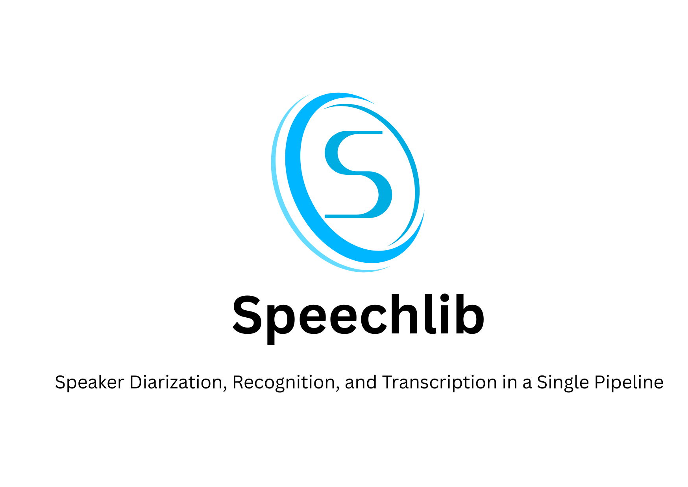
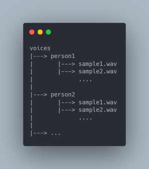
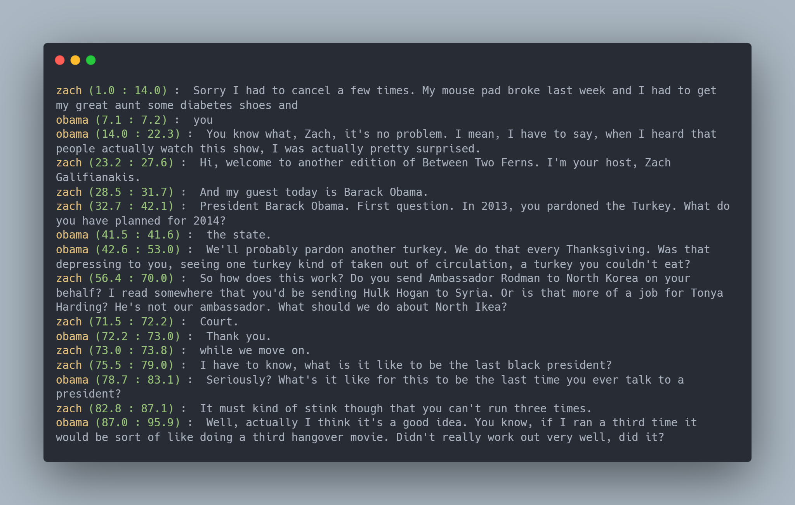

# Recall.ai - Meeting Transcription API

If you’re looking for a transcription API for meetings, consider checking out [Recall.ai](https://www.recall.ai/?utm_source=github&utm_medium=sponsorship&utm_campaign=speechlib), an API that works with Zoom, Google Meet, Microsoft Teams, and more.
Recall.ai diarizes by pulling the speaker data and separate audio streams from the meeting platforms, which means 100% accurate speaker diarization with actual speaker names.

# Speechlib

<p align="center">
  
</p>

<p align="center">
    <a href="./LICENSE"></a>
    <a href="https://github.com/NavodPeiris/speechlib/releases"></a>
    <a href="support os"></a>
    <a href=""></a>
    <a href="https://github.com/NavodPeiris/speechlib/issues"></a>
    <a href="https://github.com/NavodPeiris/speechlib/stargazers"></a>
    <a href="https://pypi.org/project/speechlib/"></a>
    
</p>

Speechlib is a library that unifies speaker diarization, transcription and speaker recognition in a single pipeline to create transcripts for audio conversations with actual speaker names and time tags. This library also contain audio preprocessor functions.

### Run your IDE as administrator

you will get following error if administrator permission is not there:

**OSError: [WinError 1314] A required privilege is not held by the client**

### Requirements

- Python 3.8 or greater

### GPU execution

GPU execution needs CUDA 11.

GPU execution requires the following NVIDIA libraries to be installed:

- [cuBLAS for CUDA 11](https://developer.nvidia.com/cublas)
- [cuDNN 8 for CUDA 11](https://developer.nvidia.com/cudnn)

There are multiple ways to install these libraries. The recommended way is described in the official NVIDIA documentation, but we also suggest other installation methods below.

### Google Colab:

on google colab run this to install CUDA dependencies:

```
!apt install libcublas11
```

You can see this example [notebook](https://colab.research.google.com/drive/1lpoWrHl5443LSnTG3vJQfTcg9oFiCQSz?usp=sharing)

### installation:

```
pip install speechlib
```

### Dependencies:

```
dependencies = [
    "accelerate>=1.12.0",
    "assemblyai>=0.50.0",
    "faster-whisper>=1.2.1",
    "huggingface-hub==0.36.0",
    "numpy==1.26.4",
    "openai-whisper>=20250625",
    "pyannote-audio==3.4.0",
    "pydub>=0.25.1",
    "speechbrain==1.0.3",
    "torch==2.2.0",
    "torchaudio==2.2.0",
    "torchvision==0.17.0",
    "transformers>=4.57.6",
]
```

### Introduction

This library does speaker diarization, speaker recognition, and transcription on a single wav file to provide a transcript with actual speaker names. This library will also return an array containing result information. ⚙

This library contains following audio preprocessing functions:

1. convert other audio formats to wav

2. convert stereo wav file to mono

3. re-encode the wav file to have 16-bit PCM encoding

`Transcriptor` initialization takes several arguments:

1. `file`: name of the wav file (e.g. `"file.wav"`) or a **list of files** (e.g. `["file1.wav", "file2.wav"]`) for highly efficient batch processing.
2. `log_folder`: folder where transcripts will be stored (default: `"logs"`).
3. `language`: language code used for transcribing. Set to `None` to enable **Auto-Detection** across supported backends.
4. `modelSize`: size of model (`"tiny"`, `"small"`, `"medium"`, `"large"`, `"large-v1"`, `"large-v2"`, `"large-v3"`, `"turbo"`, `"large-v3-turbo"`).
5. `ACCESS_TOKEN`: HuggingFace access token. If omitted, it automatically reads from `os.environ["HUGGINGFACE_ACCESS_TOKEN"]`.
   - Permission to access `pyannote/speaker-diarization@2.1` and `pyannote/segmentation` is required.
   - Token requires permission for 'Read access to contents of all public gated repos you can access'.
6. `voices_folder`: folder containing subfolders named after each speaker with voice samples. If not provided, speaker tags will be arbitrary `SPEAKER_XX`.
7. `quantization`: whether to use int8 quantization (speeds up faster-whisper but may lower accuracy).
8. `output_format`: The format for the transcript files: `"txt"`, `"json"`, or `"both"` (default).
9. `**kwargs`: Pass any additional parameters to deeply customize Pyannote Diarization (e.g., `min_speakers`, `max_speakers`) and Whisper transcribers (e.g., `beam_size`, `temperature`, `patience`, `condition_on_previous_text`).

For batch processing, the Pyannote diarization pipeline is **cached in memory**, meaning it only loads once, significantly speeding up consecutive files. Both standard `.txt` and rich `.json` (containing exact timestamps, detected language, and model used) transcripts are saved to the `log_folder`.

For an in-depth guide on the new advanced features (like strict backend validation and deep kwarg routing), please check out [ADVANCED_USAGE.md](./ADVANCED_USAGE.md).

### Transcription example:

```python
import os
from speechlib import Transcriptor

# Make sure you set your HuggingFace token in the environment!
# os.environ["HUGGINGFACE_ACCESS_TOKEN"] = "your_huggingface_token"

# ==========================================
# Example 1: Basic Single File & Auto-Detect
# ==========================================
print("--- Example 1: Basic Usage ---")
basic_transcriptor = Transcriptor(
    file="obama_zach.wav", 
    log_folder="logs_basic", 
    language=None,             # None automatically triggers language detection
    modelSize="turbo",         # 'turbo' models are fully supported!
    # ACCESS_TOKEN=None,       # If omitted, reads from os.environ["HUGGINGFACE_ACCESS_TOKEN"]
    output_format="both",      # Choose between "txt", "json", or "both"
)

# Use normal whisper
res1 = basic_transcriptor.whisper()


# ==========================================
# Example 2: Batch Processing & Customization
# ==========================================
print("\n--- Example 2: Batch Processing & Advanced Customization ---")
files_to_process = ["obama_zach.wav", "another_audio.wav"]
voices_folder = "" # Folder containing subfolders named after each speaker with voice samples

# You can pass ANY **kwargs to deeply customize Pyannote and Whisper parameters!
advanced_transcriptor = Transcriptor(
    file=files_to_process,     # Pass a list of files! Pyannote pipeline is automatically cached!
    log_folder="logs_batch", 
    language="en", 
    modelSize="large-v3-turbo", 
    quantization=True,         # Speeds up faster-whisper via int8 quantization
    output_format="json",      # Output ONLY the rich JSON log
    
    # --- Diarization Kwargs ---
    min_speakers=1,
    max_speakers=5,
    
    # --- Whisper / Faster-Whisper Kwargs ---
    beam_size=10,
    temperature=[0.0, 0.2, 0.4, 0.6, 0.8, 1.0],
    patience=1.0,
    condition_on_previous_text=False
)

# Uncomment the backend you want to use:

# 1. Use normal whisper
# res = advanced_transcriptor.whisper()

# 2. Use faster-whisper (simply faster)
res2 = advanced_transcriptor.faster_whisper()

# 3. Use a custom trained whisper model
# res3 = advanced_transcriptor.custom_whisper("D:/whisper_tiny_model/tiny.pt")

# 4. Use a huggingface whisper model
# res4 = advanced_transcriptor.huggingface_model("Jingmiao/whisper-small-chinese_base")

# 5. Use assembly ai model
# res5 = advanced_transcriptor.assemby_ai_model("assemblyAI api key")

# res --> [
#   {"start_time": ..., "end_time": ..., "text": ..., "speaker": ..., "file_name": ...}, 
#   ...
# ]
```

#### if you don't want speaker names: keep voices_folder as an empty string ""

start: starting time of speech in seconds  
end: ending time of speech in seconds  
text: transcribed text for speech during start and end  
speaker: speaker of the text

#### voices_folder structure:



#### Transcription:



supported language codes:

```
"af", "am", "ar", "as", "az", "ba", "be", "bg", "bn", "bo", "br", "bs", "ca", "cs", "cy", "da", "de", "el", "en", "es", "et", "eu", "fa", "fi", "fo", "fr", "gl", "gu", "ha", "haw", "he", "hi", "hr", "ht", "hu", "hy", "id", "is","it", "ja", "jw", "ka", "kk", "km", "kn", "ko", "la", "lb", "ln", "lo", "lt", "lv", "mg", "mi", "mk", "ml", "mn","mr", "ms", "mt", "my", "ne", "nl", "nn", "no", "oc", "pa", "pl", "ps", "pt", "ro", "ru", "sa", "sd", "si", "sk","sl", "sn", "so", "sq", "sr", "su", "sv", "sw", "ta", "te", "tg", "th", "tk", "tl", "tr", "tt", "uk", "ur", "uz","vi", "yi", "yo", "zh", "yue"
```

supported language names:

```
"Afrikaans", "Amharic", "Arabic", "Assamese", "Azerbaijani", "Bashkir", "Belarusian", "Bulgarian", "Bengali","Tibetan", "Breton", "Bosnian", "Catalan", "Czech", "Welsh", "Danish", "German", "Greek", "English", "Spanish","Estonian", "Basque", "Persian", "Finnish", "Faroese", "French", "Galician", "Gujarati", "Hausa", "Hawaiian","Hebrew", "Hindi", "Croatian", "Haitian", "Hungarian", "Armenian", "Indonesian", "Icelandic", "Italian", "Japanese","Javanese", "Georgian", "Kazakh", "Khmer", "Kannada", "Korean", "Latin", "Luxembourgish", "Lingala", "Lao","Lithuanian", "Latvian", "Malagasy", "Maori", "Macedonian", "Malayalam", "Mongolian", "Marathi", "Malay", "Maltese","Burmese", "Nepali", "Dutch", "Norwegian Nynorsk", "Norwegian", "Occitan", "Punjabi", "Polish", "Pashto","Portuguese", "Romanian", "Russian", "Sanskrit", "Sindhi", "Sinhalese", "Slovak", "Slovenian", "Shona", "Somali","Albanian", "Serbian", "Sundanese", "Swedish", "Swahili", "Tamil", "Telugu", "Tajik", "Thai", "Turkmen", "Tagalog","Turkish", "Tatar", "Ukrainian", "Urdu", "Uzbek", "Vietnamese", "Yiddish", "Yoruba", "Chinese", "Cantonese",
```

### Audio preprocessing example:

```
from speechlib import PreProcessor

file = "obama1.mp3"
#initialize
prep = PreProcessor()
# convert mp3 to wav
wav_file = prep.convert_to_wav(file)

# convert wav file from stereo to mono
prep.convert_to_mono(wav_file)

# re-encode wav file to have 16-bit PCM encoding
prep.re_encode(wav_file)
```

### Performance

```
These metrics are from Google Colab tests.
These metrics do not take into account model download times.
These metrics are done without quantization enabled.
(quantization will make this even faster)

metrics for faster-whisper "tiny" model:
    on gpu:
        audio name: obama_zach.wav
        duration: 6 min 36 s
        diarization time: 24s
        speaker recognition time: 10s
        transcription time: 64s


metrics for faster-whisper "small" model:
    on gpu:
        audio name: obama_zach.wav
        duration: 6 min 36 s
        diarization time: 24s
        speaker recognition time: 10s
        transcription time: 95s


metrics for faster-whisper "medium" model:
    on gpu:
        audio name: obama_zach.wav
        duration: 6 min 36 s
        diarization time: 24s
        speaker recognition time: 10s
        transcription time: 193s


metrics for faster-whisper "large" model:
    on gpu:
        audio name: obama_zach.wav
        duration: 6 min 36 s
        diarization time: 24s
        speaker recognition time: 10s
        transcription time: 343s
```

### Citation

If you use Speechlib in your research or project, please cite it as:

```bibtex
@software{speechlib,
  author       = {NavodPeiris},
  title        = {Speechlib: Speaker Diarization, Recognition, and Transcription in a Single Pipeline},
  year         = {2024},
  publisher    = {GitHub},
  url          = {https://github.com/NavodPeiris/speechlib}
}
```

### Sponsorship

If you find Speechlib useful, please consider supporting its development:

- [GitHub Sponsors](https://github.com/sponsors/NavodPeiris)

Your support helps maintain and improve the library. Thank you!
